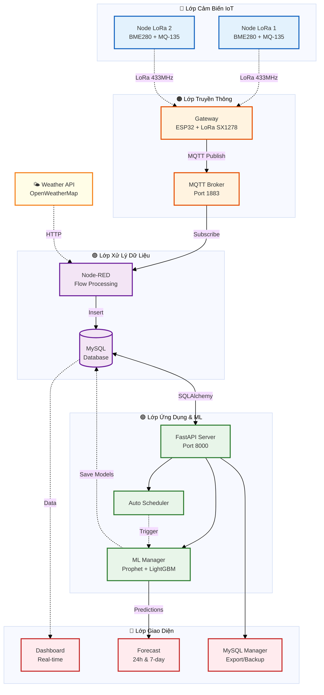
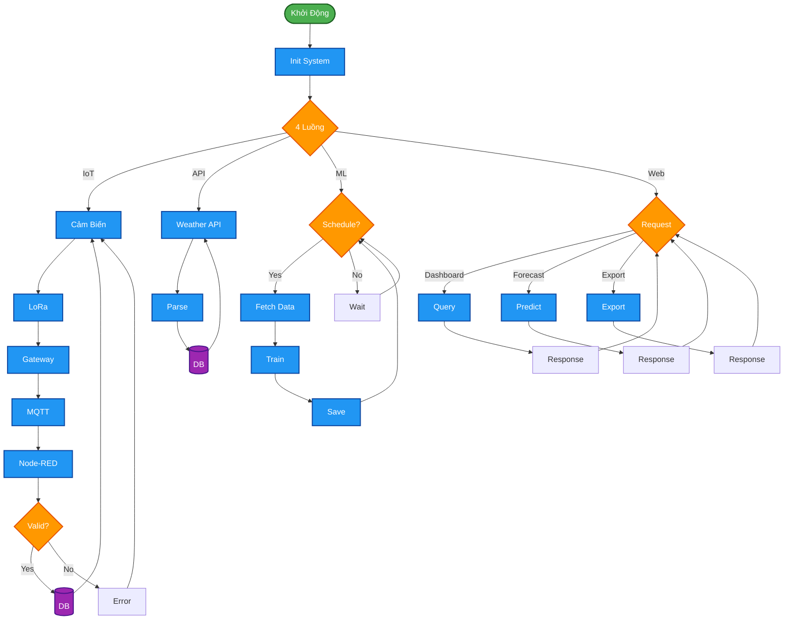
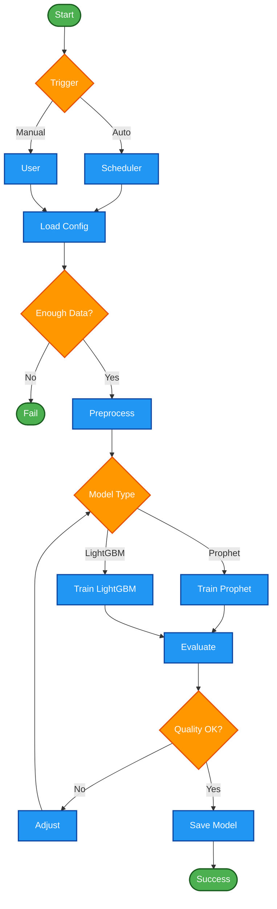
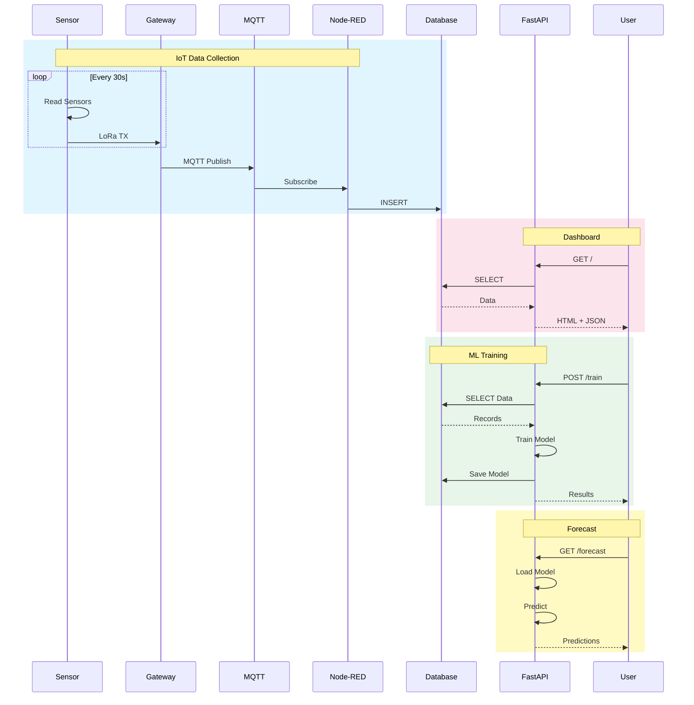
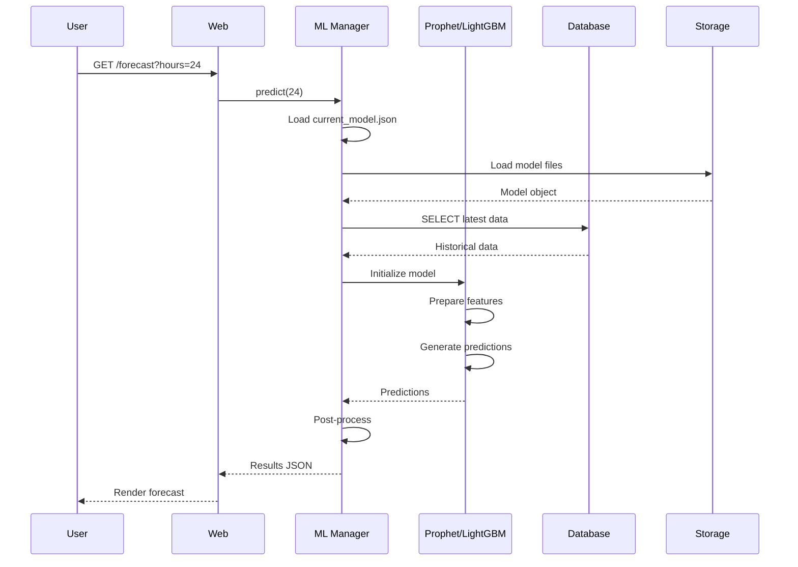
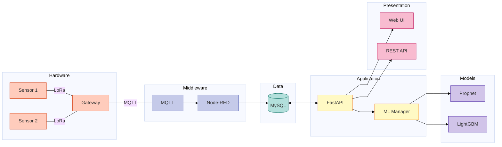

# 📊 Sơ Đồ Hệ Thống - AIoT Weather Forecasting

> Tài liệu sơ đồ kỹ thuật cho báo cáo - Đã tối ưu cho in ấn

**Hướng dẫn xem**: Nhấn `Ctrl + Shift + V` trong VS Code | Xuất ảnh: [Mermaid Live](https://mermaid.live/)

---

## 1. Sơ Đồ Khối Hệ Thống

---

## 2. Lưu Đồ Thuật Toán Hệ Thống

---

## 3. Lưu Đồ ML Training

---

## 4. Sequence Diagram - Thu Thập Dữ Liệu

---

## 5. Sequence Diagram - ML Prediction

---

## 6. Component Interaction

---

## Thông Số Kỹ Thuật

### Cảm Biến

| Cảm Biến | Đo Lường | Độ Chính Xác |
|----------|----------|--------------|
| BME280 | Nhiệt độ, Độ ẩm, Áp suất | ±1°C, ±3%RH, ±1hPa |
| MQ-135 | Chất lượng không khí | Định tính |
| GP2Y1010AU0F | Bụi PM2.5 | ±10% |

### Truyền Thông

- **LoRa**: 433MHz, SF7-12, BW 125kHz
- **MQTT**: QoS 1, Port 1883
- **HTTP**: REST API, JSON

### ML Hyperparameters

**Prophet**: changepoint_prior_scale=0.05, seasonality_prior_scale=10.0  
**LightGBM**: num_leaves=31, learning_rate=0.05, n_estimators=100

---

**Tài liệu tham khảo**: [README.md](file:///G:/DATN/AIoT-Based-Weather-Forecasting-System-Using-Machine-Learning/README.md) | [main.py](file:///G:/DATN/AIoT-Based-Weather-Forecasting-System-Using-Machine-Learning/src/AIoT-Based Weather Forecasting System Using Machine Learning/python-web/main.py)
